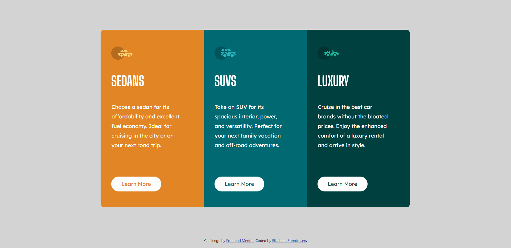
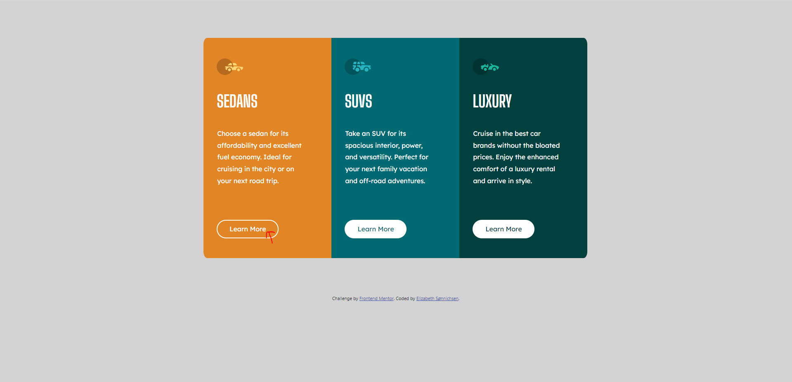

# 3-col-preview-card
Another Frontend Mentor challenge using only CSS and HTML (and a tiny bit of bootstrap)
# Frontend Mentor - 3-column preview card component solution

This is a solution to the [3-column preview card component challenge on Frontend Mentor](https://www.frontendmentor.io/challenges/3column-preview-card-component-pH92eAR2-). Frontend Mentor challenges help you improve your coding skills by building realistic projects. 

## Table of contents

- [Overview](#overview)
  - [The challenge](#the-challenge)
  - [Screenshot](#screenshot)
- [My process](#my-process)
  - [Built with](#built-with)
  - [What I learned](#what-i-learned)
  - [Continued development](#continued-development)
  - [Useful resources](#useful-resources)
- [Author](#author)
- [Acknowledgments](#acknowledgments)


## Overview

### The challenge

Users should be able to:

- View the optimal layout depending on their device's screen size [X]
- See hover states for interactive elements [X]

### Screenshot





## My process

- Applying the simple HTML tags
- identifying the colours for the cards
- applying the other relevant styles from google fonts
- applying tags to all the pieces
- styling for general style and then refining on smaller and smaller details
- applying button behaviour
- continuing refinement, especially when viewing on different viewports
- polishing and debugging


### Built with

- A tiny bit of bootstrap (but not really)
- Semantic HTML5 markup
- CSS custom properties
- Flexbox
- CSS Grid
- Mobile-first workflow (heavy consideration on tablet view as well, but failed)


### What I learned

```html
<h1>Some HTML code I'm proud of</h1>
```
<div class="row content">  
  <div class="col-lg-4 col-md-6 sedan-card">
    <svg width="64" height="40" xmlns="http://www.w3.org/2000/svg"><g fill="none" fill-rule="evenodd"><circle fill="#000" opacity=".201" cx="20" cy="20" r="20"/><path d="M52.936 24.11c1.942 0 3.517 1.542 3.517 3.445 0 1.903-1.575 3.445-3.517 3.445s-3.516-1.542-3.516-3.445c0-1.903 1.574-3.445 3.516-3.445zm-21.957 0c1.942 0 3.517 1.542 3.517 3.445 0 1.903-1.575 3.445-3.517 3.445s-3.516-1.542-3.516-3.445c0-1.903 1.574-3.445 3.516-3.445zm6.948-4.848v1.429c0 .716.61 1.293 1.348 1.259a1.295 1.295 0 001.225-1.295v-1.393h8.256l13.483 1.313c.956.093 1.676.881 1.676 1.814 0 2.89-2.126 5.303-4.926 5.819.397-3.557-2.458-6.62-6.053-6.62-3.646 0-6.504 3.14-6.039 6.723h-9.879c.466-3.588-2.397-6.722-6.039-6.722-3.595 0-6.45 3.062-6.052 6.62-2.14-.398-3.916-1.912-4.61-3.931h1.142c.731 0 1.32-.598 1.285-1.322-.033-.678-.629-1.2-1.322-1.2H20v-.251c0-1.274 1.066-2.243 2.306-2.243h15.62zM42.59 11c2.645 0 4.99 1.556 5.972 3.963l.726 1.779H40.17L38.413 11h4.178zm-6.865 0l1.758 5.741H26.505l3.357-3.654A6.502 6.502 0 0134.644 11h1.082z" fill="#FFD473" fill-rule="nonzero"/></g></svg>
    <h1 class="sedan-h1">SEDANS</h1>
      <p>Choose a sedan for its affordability and excellent fuel economy. Ideal for cruising in the city 
      or on your next road trip.</p>
    <button class="btn sedan-btn">Learn More</button>
  </div>

  Being able to use the 'row' and 'col' properties effectively to align all the content properly was pretty huge for me.

```css
.proud-of-this-css {
  color: papayawhip;
}
```
I am happy with the below CSS because I had just learning media queries in my bootcamp and was able to apply it well to 
this project. I could only to it to a mobile view and am still testing to figure out how to apply it to a tablet view.

@media (max-width: 1000px) {

    .sedan-card {
        border-radius: 3% 3% 0 0;
}

    .luxury-card {
        border-radius: 0 0 3% 3%;
    }

}

This padding amount seems to be the magic numbers to center things on desktop. So I will enshrine it here for all eternity.

.content {
    /*padding centers the whole contents */
    padding: 7% 15%;   
}


### Continued development

As stated before, I just started learning media queries and will work to figure out how to make websites mobile and tablet focused FIRST,
as more internet is being viewed on smaller ports than ever before.

I will also try and delve more into screen reader assistance and make the internet continually more accessible.

### Useful resources

My bootcamp on Udemy! [https://www.udemy.com/course/the-complete-web-development-bootcamp/]


## Author

- Website - [Add your name here](https://www.your-site.com)
- Frontend Mentor - [@Azulio123](https://www.frontendmentor.io/profile/Azulio123)


## Acknowledgments

My husband helped a bit, of course. Searching around on the internet, in particular a few great CSS websites helped. The resources given fromy my last challenge were also quite valuable. :3
